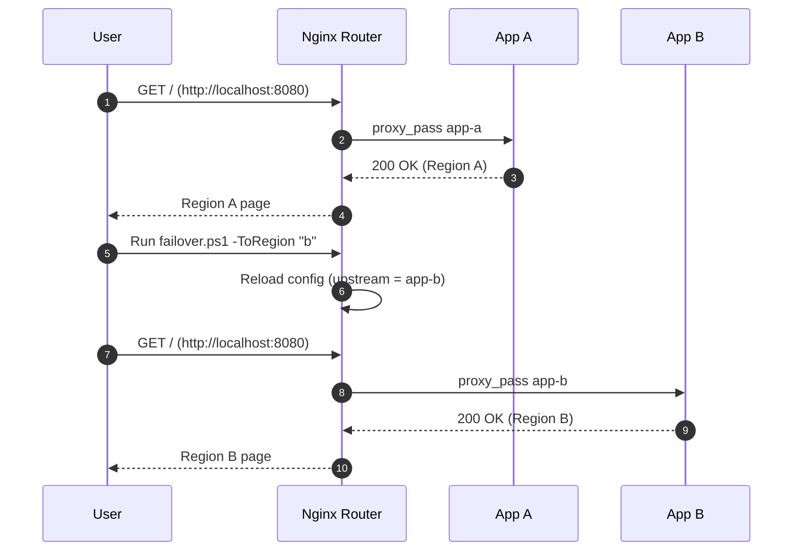
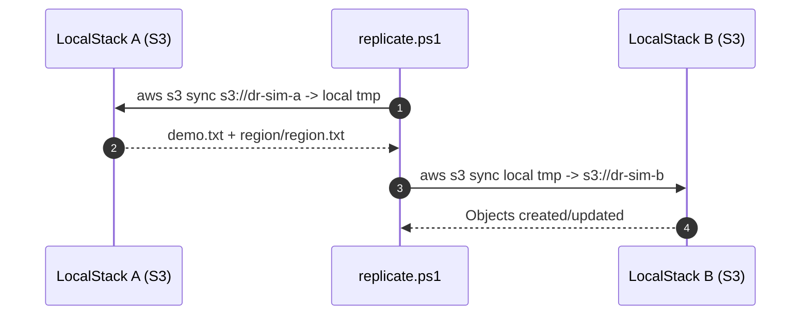
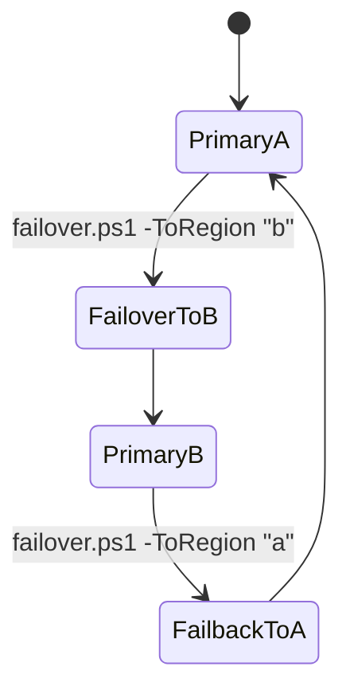

# Local Multi-Region DR Simulation

A production-style, multi-region disaster recovery (DR) architecture you can run entirely on a laptop. It simulates two AWS regions using LocalStack, provisions regional S3 with Terraform, replicates data locally, and performs active/standby failover through an Nginx router.

## Architecture

```mermaid
flowchart LR
  subgraph user[User / Demo]
    U[Browser]
  end

  subgraph router[Routing Layer]
    R[Nginx Router<br/>:8080]
  end

  subgraph regionA[Region A (Primary)]
    AAPP[App A Container]
    ALS[LocalStack A<br/>S3, IAM, STS<br/>:4566]
    AB[(S3 Bucket A)]
  end

  subgraph regionB[Region B (DR)]
    BAPP[App B Container]
    BLS[LocalStack B<br/>S3, IAM, STS<br/>:4567]
    BB[(S3 Bucket B)]
  end

  U --> R
  R --> AAPP
  R --> BAPP
  AAPP --- ALS
  BAPP --- BLS
  ALS --> AB
  BLS --> BB
  AB -. replicate (sync) .-> BB

  classDef primary fill:#e8f5e9,stroke:#2e7d32,stroke-width:1px;
  classDef dr fill:#fff3e0,stroke:#ef6c00,stroke-width:1px;
  class ALS,AB,AAPP primary;
  class BLS,BB,BAPP dr;
```

### Failover Flow (Router Switch)



### Data Replication Flow (Local Simulation)



### DR State Model



### Demo Timeline

```mermaid
gantt
  title DR Demo Timeline (Local)
  dateFormat  HH:mm
  axisFormat  %H:%M
  section Setup
  Start containers          :a1, 00:00, 00:01
  Terraform apply (A+B)     :a2, 00:01, 00:03
  section Data
  Upload demo file          :b1, 00:03, 00:01
  Replicate to Region B     :b2, 00:04, 00:01
  section Failover
  Switch traffic to B       :c1, 00:05, 00:01
  Switch traffic to A       :c2, 00:06, 00:01
```



## Prerequisites

- Docker Desktop (running)
- Terraform CLI
- AWS CLI v2

## Quick Start

1. Start local services:

```powershell
infra\scripts\start.ps1
```

2. Provision both regions:

```powershell
infra\scripts\apply.ps1
```

3. Upload a demo file to Region A:

```powershell
infra\scripts\upload.ps1
```

4. Replicate data to Region B:

```powershell
infra\scripts\replicate.ps1
```

5. Validate objects:

```powershell
infra\scripts\status.ps1
```

6. Failover to Region B:

```powershell
infra\scripts\failover.ps1 -ToRegion "b"
```

7. Fail back to Region A:

```powershell
infra\scripts\failover.ps1 -ToRegion "a"
```

## Endpoints

- Router: `http://localhost:8080`
- LocalStack Region A: `http://localhost:4566`
- LocalStack Region B: `http://localhost:4567`

## What Gets Provisioned

- S3 Bucket A (Region A)
- S3 Bucket B (Region B)
- Versioning enabled
- AES256 server-side encryption
- Lifecycle policy for noncurrent versions
- Public access blocked
- Region marker object at `region/region.txt`

## Runbook (Operator View)

**Failover to Region B**
- Command: `infra\scripts\failover.ps1 -ToRegion "b"`
- Expected: Router now sends all traffic to App B
- Verify: Refresh `http://localhost:8080`

**Failback to Region A**
- Command: `infra\scripts\failover.ps1 -ToRegion "a"`
- Expected: Router now sends all traffic to App A
- Verify: Refresh `http://localhost:8080`

## RTO/RPO (Local Demo Assumptions)

- RTO: ~1 minute (router reload + validation)
- RPO: ~1 minute (manual sync interval)

These are simulation values for a local demo. In real AWS, RTO/RPO depend on replication strategy and automation.

## Repository Layout

- `infra/envs/region-a`: Terraform root for Region A
- `infra/envs/region-b`: Terraform root for Region B
- `infra/modules/storage`: Shared storage module
- `infra/docker`: Docker Compose, router config, demo app pages
- `infra/scripts`: Runbooks (start/apply/upload/replicate/failover)
- `infra/state`: Local Terraform state per region

## Scripts (What Each One Does)

- `infra\\scripts\\start.ps1`: Starts LocalStack (A+B), router, and demo apps via Docker Compose
- `infra\\scripts\\apply.ps1`: Runs Terraform `init` and `apply` for both regions and writes local state
- `infra\\scripts\\upload.ps1`: Creates a demo file locally and uploads it to Region A bucket
- `infra\\scripts\\replicate.ps1`: Simulates replication by syncing Region A bucket to local disk and then to Region B
- `infra\\scripts\\status.ps1`: Lists buckets and objects in both regions to verify replication
- `infra\\scripts\\failover.ps1`: Switches router upstream to Region A or B and reloads Nginx
- `infra\\scripts\\cleanup.ps1`: Stops and removes containers, volumes, and the Docker network

## Troubleshooting

**Docker containers already exist**
- Run: `infra\scripts\cleanup.ps1`

**AWS CLI not found**
- Verify: `aws --version`
- Script fallback: `C:\Program Files\Amazon\AWSCLIV2\aws.exe`

**LocalStack not reachable**
- Ensure Docker Desktop is running
- Check containers: `docker ps`

**Terraform apply is slow or stuck**
- Re-run: `infra\scripts\apply.ps1`
- LocalStack images can take time on first pull

## Security Notes

- Local credentials are stubbed (`test` / `test`)
- This repo is for local simulation only
- No external AWS resources are created

## How To Adapt For Real AWS

- Replace LocalStack endpoints with AWS endpoints
- Use real AWS credentials or IAM roles
- Implement native S3 replication and Route 53 failover
- Store state in remote backend (S3 + DynamoDB lock)

## Cleanup

```powershell
infra\scripts\cleanup.ps1
```
